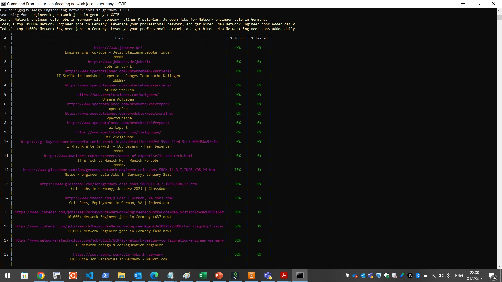
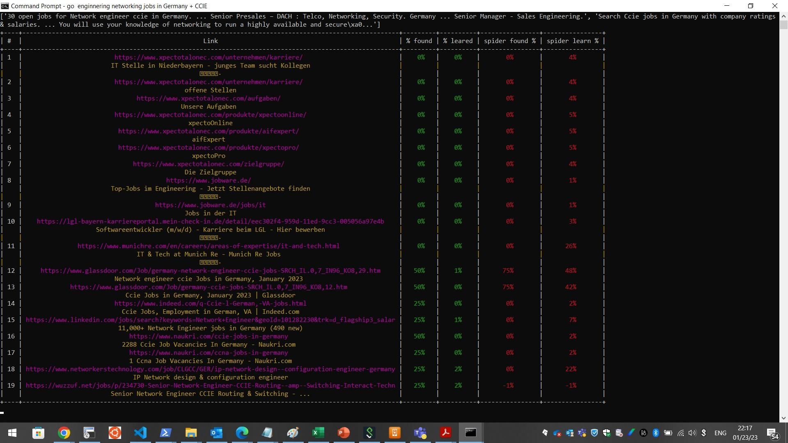

# Windows/Linux CLI/Shell Search Tool
A command line tool for searching the web with enhanced site review based on a trained model.

## Installation
Download the go.bat file and the .py script file.

Add the go.bat file to your Windows path. On Windows, you can do this by:

Open the Start menu and search for "Environment Variables"

Click on "Edit the system environment variables"

Click on the "Environment Variables" button

Under "User variables", click on "New"

Enter "Path" as the variable name and the location of the go.bat file as the variable value.

Make sure you have Python 3 installed on your computer.

## Usage
To use the tool, open a command line interface (CLI) or a shell in linux and type go followed by your search query.

go [search parameters]

c:\> go engineering network jobs in germany + CCIE

A pre-trained list of tokens are required to make your search based on the model. I use my resume for example to build my own model. You can be creative by using any model to base your search on.
You can minimize your search by using + and - to include and exclude keywords.
For a more detailed and deep search, enter 99.
The results will be displayed live on your terminal or CLI window.

## Examples

## Notes
Make sure to keep the go.bat and .py script file in the same folder.
The search results are based on a trained model, so the results may vary depending on the data the model was trained on.
